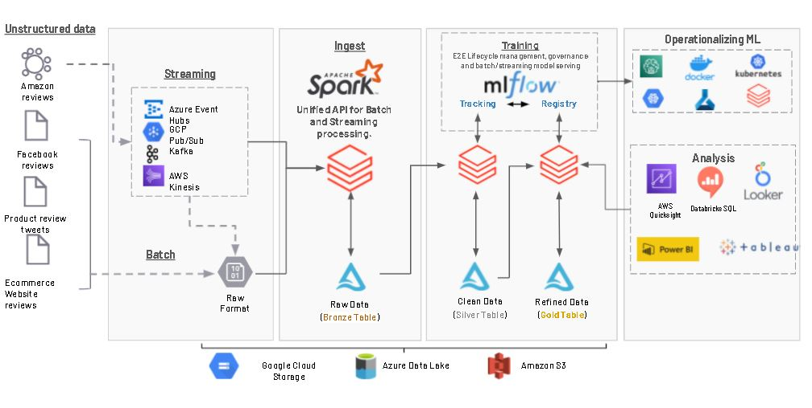

# Spam Review Filter NLP using Spark
The goal of this product is to showcase how to set a NLP capable Data pipeline at scale using Databricks, Delta, MLFlow and John Snow Labs to detect fake reviews.

# Dataset
Deceptive Opinion Spam Corpus v1.4

Overview
--------

This corpus consists of truthful and deceptive hotel reviews of 20 Chicago
hotels. The data is described in two papers according to the sentiment of the
review. In particular, we discuss positive sentiment reviews in [1] and negative
sentiment reviews in [2].

While we have tried to maintain consistent data preprocessing procedures across
the data, there *are* differences which are explained in more detail in the
associated papers. Please see those papers for specific details.  

This corpus contains:

* 400 truthful positive reviews from TripAdvisor (described in [1])
* 400 deceptive positive reviews from Mechanical Turk (described in [1])
* 400 truthful negative reviews from Expedia, Hotels.com, Orbitz, Priceline,
  TripAdvisor and Yelp (described in [2])
* 400 deceptive negative reviews from Mechanical Turk (described in [2])

Each of the above datasets consist of 20 reviews for each of the 20 most popular
Chicago hotels (see [1] for more details). The files are named according to the
following conventions:

* Directories prefixed with `fold` correspond to a single fold from the
  cross-validation experiments reported in [1] and [2].		

* Files are named according to the format `%c_%h_%i.txt`, where:

    * %c denotes the class: (t)ruthful or (d)eceptive

    * %h denotes the hotel:

        * affinia: Affinia Chicago (now MileNorth, A Chicago Hotel)
        * allegro: Hotel Allegro Chicago - a Kimpton Hotel
        * amalfi: Amalfi Hotel Chicago
        * ambassador: Ambassador East Hotel (now PUBLIC Chicago)
        * conrad: Conrad Chicago
        * fairmont: Fairmont Chicago Millennium Park
        * hardrock: Hard Rock Hotel Chicago
        * hilton: Hilton Chicago
        * homewood: Homewood Suites by Hilton Chicago Downtown
        * hyatt: Hyatt Regency Chicago
        * intercontinental: InterContinental Chicago
        * james: James Chicago
        * knickerbocker: Millennium Knickerbocker Hotel Chicago
        * monaco: Hotel Monaco Chicago - a Kimpton Hotel
        * omni: Omni Chicago Hotel
        * palmer: The Palmer House Hilton
        * sheraton: Sheraton Chicago Hotel and Towers
        * sofitel: Sofitel Chicago Water Tower
        * swissotel: Swissotel Chicago
        * talbott: The Talbott Hotel

    * %i serves as a counter to make the filename unique

Questions
---------

Please direct questions to Myle Ott (<myleott@cs.cornell.edu>)

References
----------

[1] M. Ott, Y. Choi, C. Cardie, and J.T. Hancock. 2011. Finding Deceptive
Opinion Spam by Any Stretch of the Imagination. In Proceedings of the 49th
Annual Meeting of the Association for Computational Linguistics: Human Language
Technologies.

[2] M. Ott, C. Cardie, and J.T. Hancock. 2013. Negative Deceptive Opinion Spam.
In Proceedings of the 2013 Conference of the North American Chapter of the
Association for Computational Linguistics: Human Language Technologies.

# Architecture Diagram

# Software and package requirements
1. Databricks, Databricks Runtime Version - 8.4 ML
2. Git

# Python Libraries Used
1. mlflow 1.9+
2. spark-nlp 3.2.2

# Java Libraries Used
1. JohnSnowLabs:spark-nlp_2.12:3.2.2

# Setup
1. Create a demo account on the Databricks Community edition. https://databricks.com/try-databricks
2. Import  Deceptive-Opinion-Spam-filter-using-John-Snow-Labs.py in your Databricks workspace. https://docs.databricks.com/notebooks/notebooks-manage.html#import-a-notebook
3. Create a cluster with latest ML runtime and attach all Java libraries used dependencies. https://docs.databricks.com/clusters/create.html & https://docs.databricks.com/libraries.html#install-a-library-on-a-cluster

# License
MIT License

Copyright (c) [2021] [Debu Sinha]

Permission is hereby granted, free of charge, to any person obtaining a copy
of this software and associated documentation files (the "Software"), to deal
in the Software without restriction, including without limitation the rights
to use, copy, modify, merge, publish, distribute, sublicense, and/or sell
copies of the Software, and to permit persons to whom the Software is
furnished to do so, subject to the following conditions:

The above copyright notice and this permission notice shall be included in all
copies or substantial portions of the Software.

THE SOFTWARE IS PROVIDED "AS IS", WITHOUT WARRANTY OF ANY KIND, EXPRESS OR
IMPLIED, INCLUDING BUT NOT LIMITED TO THE WARRANTIES OF MERCHANTABILITY,
FITNESS FOR A PARTICULAR PURPOSE AND NONINFRINGEMENT. IN NO EVENT SHALL THE
AUTHORS OR COPYRIGHT HOLDERS BE LIABLE FOR ANY CLAIM, DAMAGES OR OTHER
LIABILITY, WHETHER IN AN ACTION OF CONTRACT, TORT OR OTHERWISE, ARISING FROM,
OUT OF OR IN CONNECTION WITH THE SOFTWARE OR THE USE OR OTHER DEALINGS IN THE
SOFTWARE.
THE SOFTWARE IS PROVIDED "AS IS", WITHOUT WARRANTY OF ANY KIND, EXPRESS OR IMPLIED, INCLUDING BUT NOT LIMITED TO THE WARRANTIES OF MERCHANTABILITY, FITNESS FOR A PARTICULAR PURPOSE AND NONINFRINGEMENT. IN NO EVENT SHALL THE AUTHORS OR COPYRIGHT HOLDERS BE LIABLE FOR ANY CLAIM, DAMAGES OR OTHER LIABILITY, WHETHER IN AN ACTION OF CONTRACT, TORT OR OTHERWISE, ARISING FROM, OUT OF OR IN CONNECTION WITH THE SOFTWARE OR THE USE OR OTHER DEALINGS IN THE SOFTWARE.
